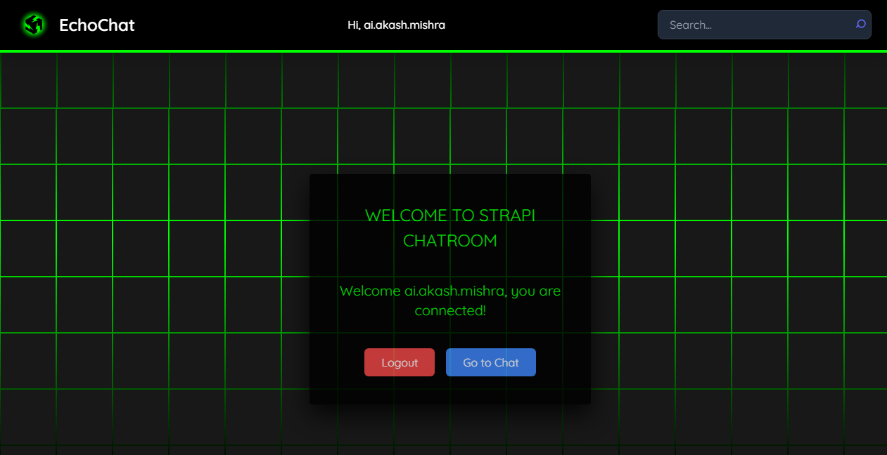

# EchoChat

# Real-Time Chat Web Application

## Overview

This is a real-time chat application built using a frontend stack of your choice and Strapi for the backend. The application facilitates instant messaging between the user and the server via WebSocket communication. It supports user authentication, responsive design, and local database storage.

## Features

1. **Backend Setup**: Powered by Strapi, an open-source headless CMS.
2. **User Authentication**: Sign up, log in, and log out functionalities using Google or GitHub OAuth.
3. **WebSocket Communication**: Real-time message exchange between the user and the server.
4. **Local Database Storage**: Uses SQLite via Strapi for storing user and chat session data.
5. **Responsive Design**: Fully optimized for desktop, tablet, and mobile devices.
6. **Optional Enhancements**: Add advanced features for better user experience.

## Tech Stack

- **Frontend**: Reactjs.
- **Backend**: Strapi (SQLite as the database).
- **WebSocket**: For real-time communication.
- **Authentication**: Google/GitHub OAuth via Strapi.

[](url)


## Getting Started

### Prerequisites

- Node.js (v16 or later)
- npm or yarn
- Strapi CLI
- A Google/GitHub developer account for OAuth setup

### Installation

1. **Clone the Repository**:

   ```bash
   git clone https://github.com/RyomenDev/EchoChat.git
   cd EchoChat
   ```

2. **Set Up Backend**:

   - Install Strapi CLI:
     ```bash
     npm install -g create-strapi-app
     ```
   - Create a Strapi app with SQLite as the database:
     ```bash
     npx create-strapi-app backend --quickstart
     ```
   - Configure Google/GitHub OAuth providers in Strapi admin panel.

3. **Set Up Frontend**:

   - Navigate to the frontend directory:
     ```bash
     cd frontend
     ```
   - Install dependencies:
     ```bash
     npm install
     ```

4. **Configure WebSocket API**:

   - Update the WebSocket URL in your frontend code to connect with the backend.

5. **Run the Application**:
   - Start the backend server:
     ```bash
     cd server
     npm run dev
     ```
   - Start the frontend development server:
     ```bash
     cd client
     npm start
     ```

### Usage

- Open the application in your browser.
- Log in using Google or GitHub.
- Send and receive messages in real-time.

## Folder Structure

```
project/
├── backend/        # Strapi backend
└── frontend/       # Frontend application
```

## Deployment

- Deploy the backend using services like Heroku or AWS.
- Deploy the frontend using Vercel or Netlify.

## License

This project is licensed under the MIT License.

## Acknowledgments

- [Strapi Documentation](https://strapi.io/documentation)
- [WebSocket MDN Docs](https://developer.mozilla.org/en-US/docs/Web/API/WebSocket)
- [OAuth Google Docs](https://developers.google.com/identity)
- [OAuth GitHub Docs](https://docs.github.com/en/developers/apps/authorizing-oauth-apps)
